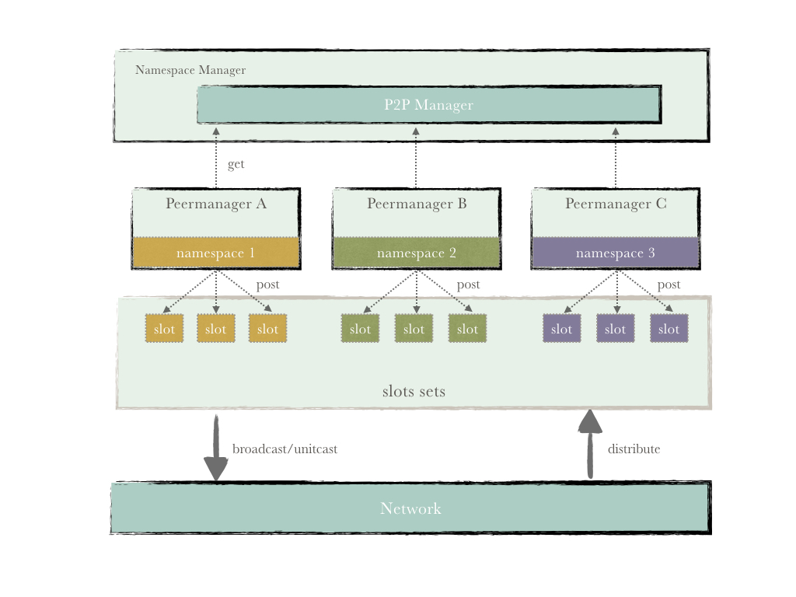
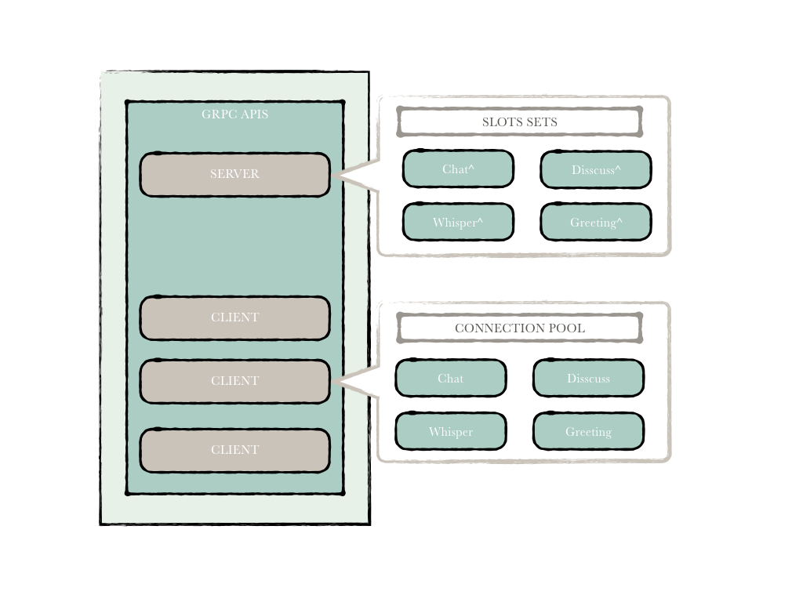

# P2P

## 1. Overview

The P2P module is the underlying Hyperchain network communication module. It guarantees the data transmission security of the communication link. The user can configure whether to enable TLS security and enable data transmission encryption (or replace the data encryption algorithm) through the configuration file. In this module, the physical connection (Network layer) is separated from the logical connection. The overall architecture of the module is as follows:

## 2. Hypernet

As the underlying communication infrastructure of Hyperchain, Hypernet provides network communication services to the upper layer by registering slots. Its main functions include establishment of communication links, data transmission, link security, and link activity control. It has two important members `Server` and `Client`. The overall structure is as follows:

### Server

In Hypernet, the Server is responsible for registering network slots, listening for services, and distributing various types of messages from the Client.

**Network Slot**

As the main mechanism of Hypernet to communicate with the upper layer, the slot is actually a multi-dimensional thread-safe map, which maps the relevant methods to different message processors for processing.

Slots as server members, with a set of slot that correspond to different namespaces, process messages from different namespaces, respectively.

### Client

Client corresponds with the Server, mainly used to handle different message sending requests. Usually a Client corresponds to several different remote Server (because a node will be connected to multiple remote peer), and communicates with different servers which will distribute message to different namespace slot to deal with. 

### TLS

Transport layer security of Hyperchain, default enable, which USES the TLSCA certificate issued by the Hyperchain to carry out secure communication, which guarantees the security of information and communications from the transport layer. Further, this option is optional.

TLS guarantees the security of information transmission at the transport layer. It is the most common implementation standard for network transmission and is adopted in almost all network security transmission.

## 3. P2PManager

`P2PManager` is used to allocate `PeerManager` in different namespaces, it has only one global instance.

### PeerManager

`PeerManager` is mainly responsible for the following sections:

- Provide different external message sending service interfaces;
- Post message to Hyperchain message middleware`eventhub`;
- Use `PeerManagerEventHub` message middleware distributes and manages the control messages of `PeerManager` to maintain the state of the entire logical network and process more complicated message logic.

In the entire network, the node can be called `Node` or `Peer`, the following look at the difference between the two.

#### Peer

All logical remote nodes are called peer, a remote node corresponds to a peer, the peer is mainly used for processing the logically message sending request. Its main function is to encrypt the message, and then call the corresponding message sending method of Hypernet Client, and the message needs to be attached namespace information.

#### Node

Node that is the local node, which is also a logical server, is mainly responsible for logically message processing of node, decryption of the message received from the network and then posts decrypted message to Hyperchain message middleware `eventhub`. Finally, the message middleware identifies this type of message should be post to which module to process, such as consensus module, executor module.

### Data transmission encryption

Data Transfer Encryption refers to the encryption of transaction information and communication messages transmitted over the network. According to user requirements, all information transmitted on Hyperchain network can be encrypted. The encryption scheme is similar to TLS, firstly the node use the ECDH algorithm to negotiate the corresponding session key, and then the session key is used to encrypt the service information which is decrypted  by the peer. All the communication between nodes will be encrypted with different session keys. This is a supplement to the security of the transport layer. Currently, hyperchain messages can use Symmetric Encryption through configuration, and can be handled in this way if there is a more sophisticated message encryption requirement.

